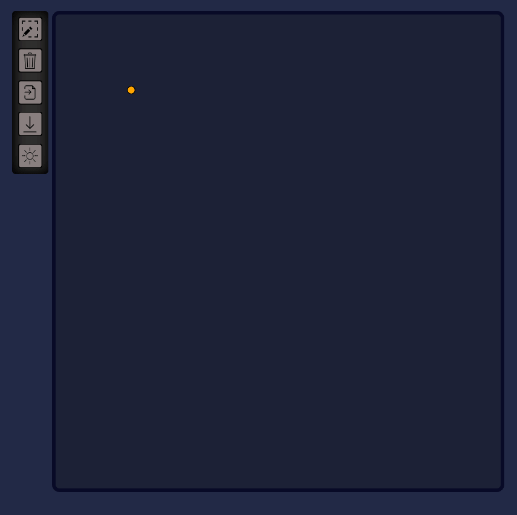

## Introduction
A svg vector graphic maker with GUI

This README also has a [Chinese version (中文版)](./README_ZH.md).

## Updates
[2022-7-5]
1. Update the UI; simplify the buttons; add two theme (dark/light).
2. Change a part of shortcuts (updated in the following).




## Basic functions

### Fast drawing
Under the default selecting mode, press `z` to switch to drawing mode temporarily.

### Create Bezier curves
Under drawing mode, you can firstly draw a line, and hold `ctrl` to draw another, then a Bezier curve is created using this two lines as control handles. (Note under the fast drawing mode, you need to hold `z` too.)
<div style='display:flex'>

</div>

### Duplicate
`ctrl` + click/drag

### Add to (or remove from) selection
`shift` + click

### Group/De-group
`ctrl+g`/`ctrl+shift+g`
<div style='display:flex'>

</div>

### Rotate
Press `alt` and then you can rotate the selected item around the yellow point ("rotation center").
<div style='display:flex'>

</div>

### Undo/Redo
`ctrl+u`/`ctrl+y`
<div style='display:flex'>

</div>

### Clear
Use the "clear" button at the left toolbox.
<div style='display:flex'>

</div>

### Delete
`Delete` Key


## Special functions
### Snapping of points
Press `shift` when dragging a point.
<div style='display:flex'>

</div>

### Snapping of angle of lines
With the rotation center at the end of the selcted line (or one line in the selection group), rotate with pressing `alt`, and you will find at some perticular angle there will show a green dash line. When the green line is visible, if you press `shift` also, then the selected items would be snapped to align with the connected (yet unselected) line(s). This might be clearer in the demonstration here.
<div style='display:flex'>

</div>

## Getting started

This project is based on Nodejs, so firstly you should have Nodejs installed on your computer.

Open command prompt under the project folder, and run the following command to install requisite npm packages.
```cmd
npm install
```

In bin/www file, you can configure your port (such as `3000`) here:
```js
var port = normalizePort(process.env.PORT || '3000');
```


Run this command to start your server:
```cmd
npm start
```

Use this link to test on your local machine (when the port is set to `3000`)：
http://127.0.0.1:3000/

