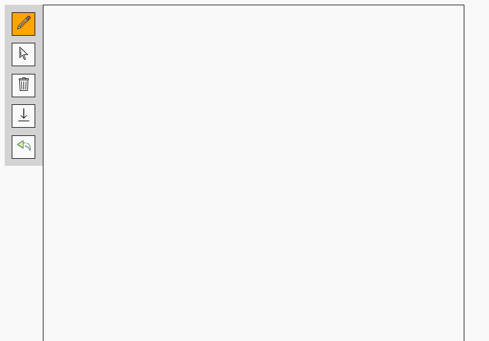

## 项目简介
web版svg矢量图制作GUI

## 功能

### 点的磁吸
拖动点时按住`ctrl`。
<div style='display:flex'>

</div>

### 组合/解组
`ctrl+g`/`ctrl+shift+g`
<div style='display:flex'>

</div>

### 绘制Bezier曲线
绘制模式下，先画一条线，然后按住`ctrl`再画另一条。
<div style='display:flex'>

</div>

### 旋转
按住`alt`即可绕黄色点（后称“旋转中心”）旋转
<div style='display:flex'>

</div>

### 线的旋转角度磁吸
当旋转中心在线（或选中组中的某根线）的端点上时（可以先将旋转中心磁吸到此处），按住`alt`旋转时，会显示绿色角度磁吸参考线，若此时也按住了`shift`，则在松开鼠标时若绿色磁吸参考线仍显示时，被旋转的对象会旋转吸附到参考线位置。具体见图，可能会更加明白。
<div style='display:flex'>

</div>

### 撤销/重做
`ctrl+z`/`ctrl+y`
<div style='display:flex'>

</div>

### 清空
左侧工具栏清空按钮
<div style='display:flex'>

</div>

### 删除元素
`Delete`键


## 开始使用

本项目基于nodejs，首先要有nodejs。

在项目目录下打开命令行，运行如下命令安装所需的npm包。
```cmd
npm install
```

在bin/www文件中
```js
var port = normalizePort(process.env.PORT || '3000');
```
处配置端口，比如`3000`。

运行以下命令开服。
```cmd
npm start
```

在浏览器端访问（当端口为`3000`时）：
http://127.0.0.1:3000/

